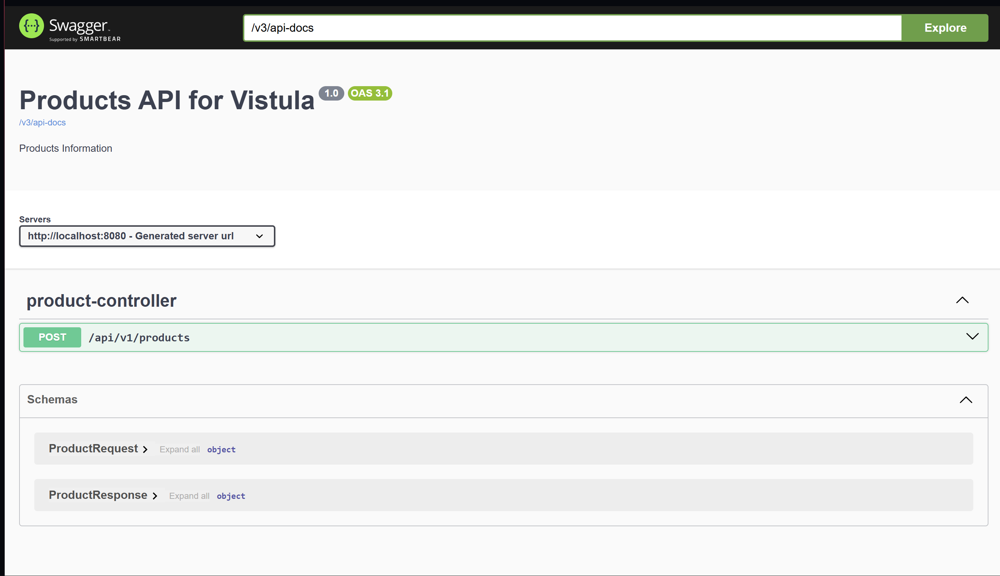
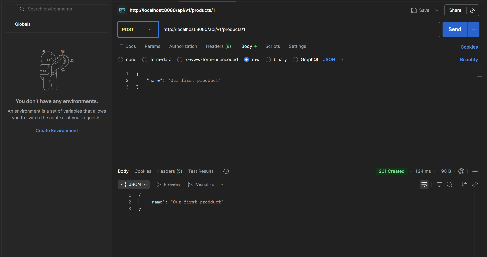

# First REST API Spring Project

This project is a RESTful API built with Spring Boot for managing products. It demonstrates the implementation of CRUD operations (Create, Read, Update, Delete), exception handling, and H2 database integration.

## Technologies
* Java 17
* Spring Boot 3.2.0
* H2 Database (In-Memory)
* Swagger UI (OpenAPI 3.0) for testing

---

##  How to Run
1.  Clone the repository.
2.  Open the project in IntelliJ IDEA.
3.  Run `FirstRestApiSpringApplication`.
4.  Open Swagger UI in your browser: `http://localhost:8080/swagger-ui/index.html`
5.  Open H2 Console (optional): `http://localhost:8080/h2-console`

---

##  API Endpoints & Tasks

### Task 2.A: Create a Product (POST)
**Endpoint:** `POST /api/v1/products`
Creates a new product by providing a name. The ID is auto-generated.

* **Request Body:**
    ```json
    {
      "name": "string"
    }
    ```
* **Response (201 Created):**
    ```json
    {
      "id": 1,
      "name": "string"
    }
    ```
**Screenshot:**


---

### Task 2.B: Get Product by ID (GET)
**Endpoint:** `GET /api/v1/products/{id}`
Retrieves a specific product using its unique ID.

* **Test:** Input ID `1`.
* **Response (200 OK):** Returns the product details.

**Screenshot:**


---

### Task 2.C & 2.D: Exception Handling (404 Not Found)
If a user tries to find a product that does not exist, the API returns a custom error message instead of a generic server error.

* **Test:** Input ID `99` (which does not exist).
* **Response (404 Not Found):**
    ```json
    {
      "message": "Product with 99 not found"
    }
    ```

**Screenshot:**


---

### Task 2.E: Update a Product (PUT)
**Endpoint:** `PUT /api/v1/products/{id}`
Updates the name of an existing product.

* **Test:** Update Product ID `1` to "Updated name".
* **Request Body:**
    ```json
    {
      "name": "Updated name"
    }
    ```
* **Response (200 OK):** The product name is updated in the database.

**Screenshot:**


---

### Task 2.F: Delete & Find All
**1. Find All Products**
**Endpoint:** `GET /api/v1/products`
Returns a list of all products currently in the database.

* **Response:**
    ```json
    [
      { "id": 1, "name": "Iphone 15 Pro" },
      { "id": 2, "name": "Samsung Galaxy" }
    ]
    ```

**2. Delete a Product**
**Endpoint:** `DELETE /api/v1/products/{id}`
Removes a product permanently.

* **Test:** Delete ID `1`.
* **Response (204 No Content):** Product is successfully removed.

**Screenshot:**


---

---

### Task 2.G: H2 Database Connection (The Final Step)
**Goal:** Verify that the application is connected to a real H2 database and that data is saved in the `PRODUCTS` table.


**Configuration Used (`application.properties`):**
```properties
spring.h2.console.enabled=true
spring.datasource.url=jdbc:h2:mem:testdb


